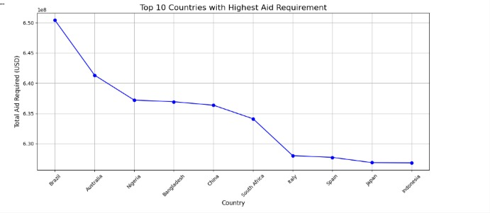
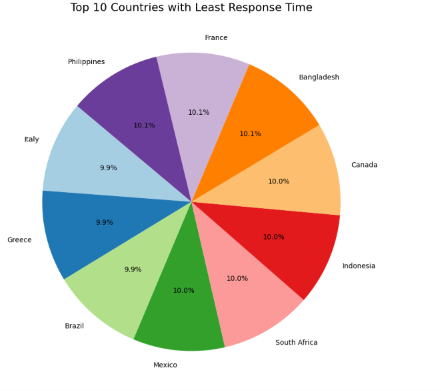
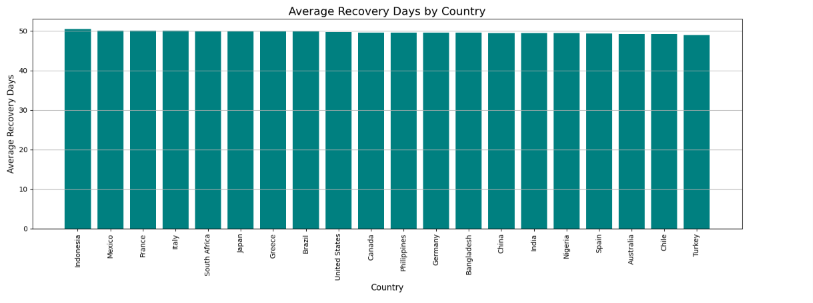

# 🌍 Disaster Response Data Analysis

## 📌 Overview

This project analyzes global disaster response data using Python. It helps identify countries requiring the highest financial aid, longest recovery periods, highest casualties, and lowest response efficiency through data cleaning, aggregation, and visualization.

---

## 🎯 Objectives

- Clean and preprocess disaster response data
- Analyze aid distribution across countries
- Evaluate disaster response efficiency
- Identify countries with highest casualties
- Visualize disaster statistics for better decision-making

---

## 📂 Dataset

The dataset contains information such as:

- Country
- Severity Index
- Casualties
- Economic Loss
- Response Time
- Aid Amount
- Recovery Days
- Latitude
- Longitude

---

## 🚀 Features

- Data Cleaning
- Missing Value Handling
- Duplicate Removal
- Country-wise Aggregation
- Aid Requirement Analysis
- Response Efficiency Analysis
- Casualty Analysis
- Recovery Time Analysis
- Data Visualization

---

## 🛠 Technologies Used

- Python
- Pandas
- NumPy
- Matplotlib
- Seaborn
- Scikit-learn

---

## 📊 Visualizations

- Line Chart – Top Countries Requiring Aid
- Histogram – Training Requirement Distribution
- Bar Chart – Countries with Highest Casualties
- Pie Chart – Countries with Fastest Response Time
- Bar Chart – Average Recovery Days

---

## 📸 Output

## 1. Highest Aid Requirements

---

## 2. Response Time Analysis

## 3. Recovery Days Analysis

---

## 📈 Future Improvements

- Interactive Dashboard using Streamlit
- Power BI Dashboard
- Machine Learning Prediction Model
- Real-Time Disaster API Integration
- Geographical Heatmaps

---

## 👨‍💻 Author

**Arpit Rajput**

Electronics and Telecommunication Engineering  
Minor in Data Science  
VJTI Mumbai
